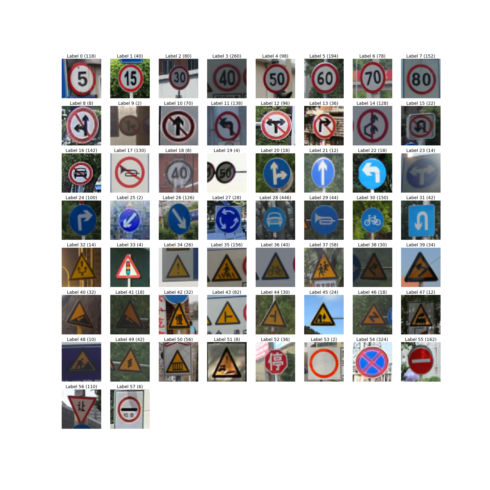
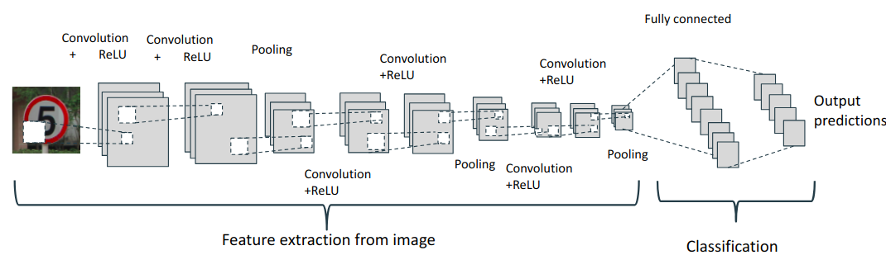

# traffic-sign-recognition

The goal of this project is to build different ML models to classify traffic sign images and compare the models performance. In this project the first model is a convolutional neural network and the second one is a combination of CNN for feature extraction from images and Random Forest for classification. Also there are some experiments with feature extraction using AlexNet.

## Data
Data used in this project is a [Chinese Traffic Sign Recognition Database](http://www.nlpr.ia.ac.cn/pal/trafficdata/recognition.html) (TSRD). The TSRD includes 6164 traffic sign images containing 58 sign categories. The images are devided into two sub-database as training database and testing database. The training database includes 4170 images while the testing one contains 1994 images. 

This dataset is quite small and the data is unbalanced.

Images which belongs to 58 different classes shown on the picture below. The number of the training images of every class shown in the brackets.

  

## CNN

CNN architecture:

  

[CNN.ipynb](./CNN.ipynb) - experiments with CNN

## Feature extraction + Random Forest

[CNN+Ensembles.ipynb](./CNN+Ensembles.ipynb) - experiments with CNN (architecture shown on the picture above) feature extraction and classification using RF.

[Alexnet_feature_extraction_plus_RF.ipynb](./Alexnet_feature_extraction_plus_RF.ipynb) - experiments with Alexnet feature extraction and RF classification.
